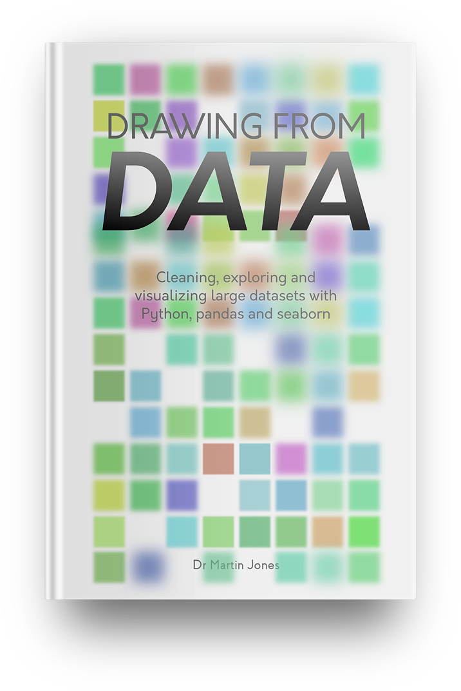
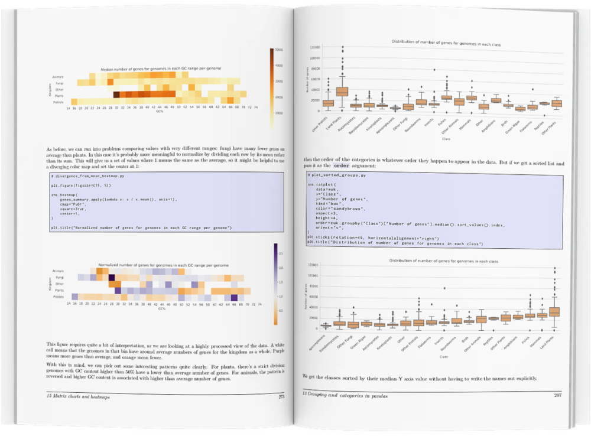
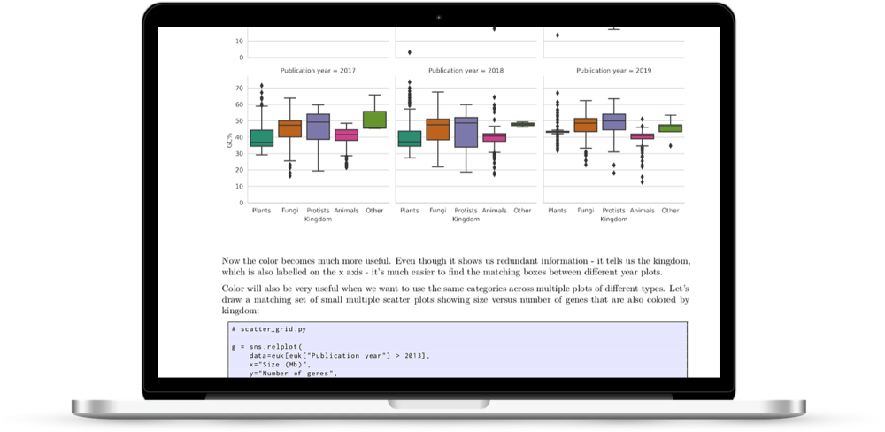
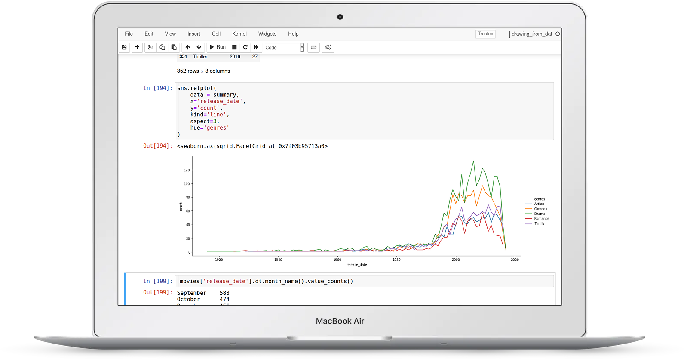
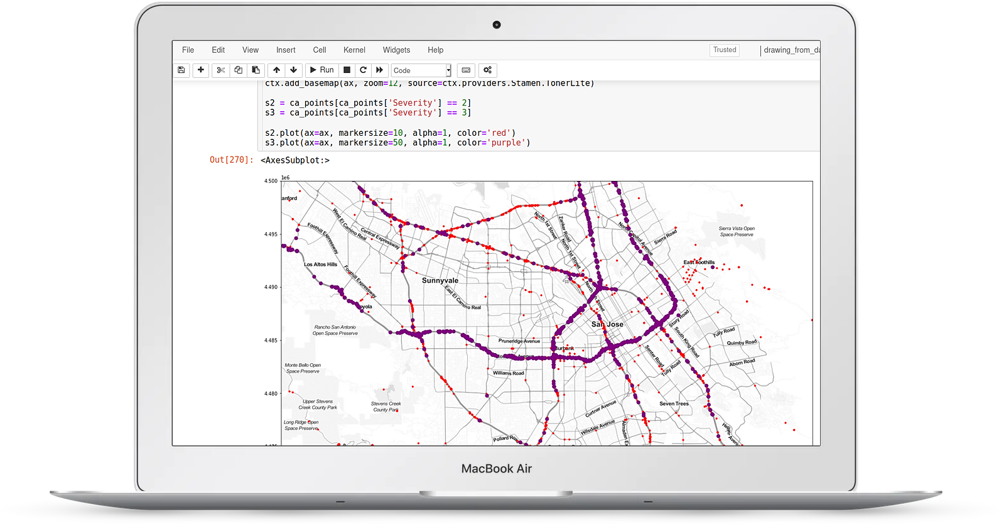
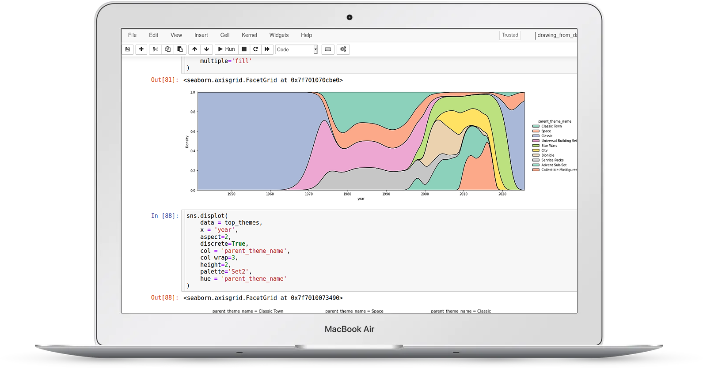
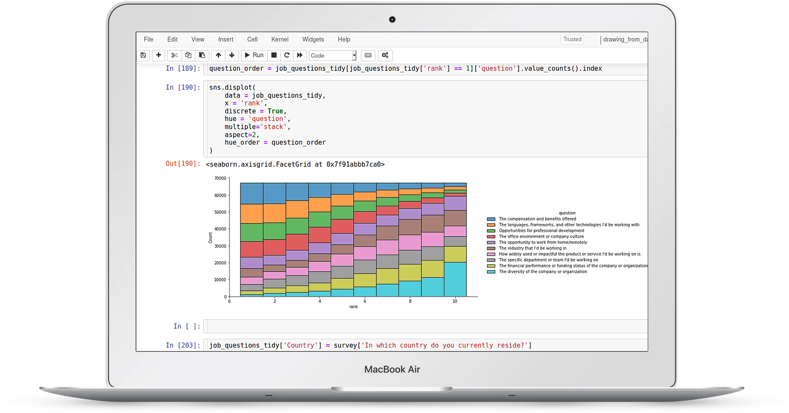
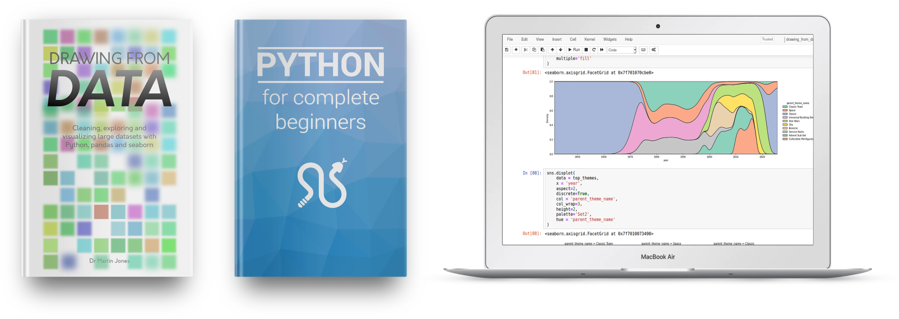
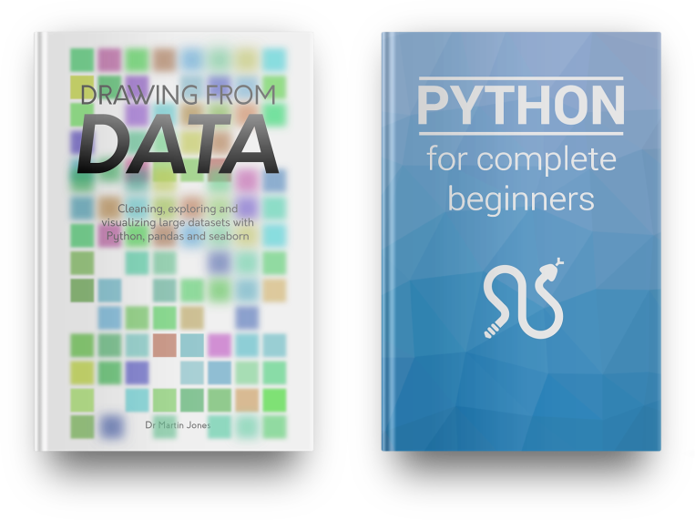

    
## Time to get to grips with your data

#### With Python, pandas and seaborn in your toolbox, you too can develop data exploration superpowers.

We're currently in a **golden age of data**. It's never been easier to assemble large datasets to probe questions in almost any field.  

But these large datasets come with their own problems:

- How to clean and validate data?

- How to combine datasets from multiple sources?

- And how to look for patterns in large, complex datasets and display your findings?

**These are the questions that we all ask when we start working with these rich data sources.**

The solution to these problems comes in the form of Python's scientific software stack. The combination of a friendly, expressive language and high quality packages makes a fantastic set of tools for data exploration.

But the packages themselves can be **hard to get to grips with**. It's difficult to know where to get started, or which sets of tools will be most useful.

You may have already encountered this. If you look at the matplotlib website, it's clear that it's a powerful charting tool - but looking at the tutorial can be daunting. The same goes for pandas: it can carry out almost any type of data manipulation, but that same power makes it hard to get to grips with.

 

---

 

Happily, learning to use Python effectively for data exploration is **a superpower that you can learn**. With a basic knowledge of Python, pandas (for data manipulation) and seaborn (for data visualization) you'll be able to understand complex datasets quickly and mine them for insight.

You'll be able to make **beautiful, informative charts** for posters, papers and presentations, and rapidly update them to reflect new data or test new hypotheses.

And you'll be able to quickly make sense of datasets from other projects - millions of rows of data will no longer be a scary prospect!

In this book, I have drawn on years of teaching experience to give you the tools you need to answer your data exploration questions. Starting with the basics, you'll learn how to use Python, pandas, seaborn and matplotlib effectively using real world examples throughout.

 
 

 
### **Just the best bits**  of the best data exploration packages

 
 

Rather than overwhelm you with information, the book concentrates on the most useful parts of the relevant libraries. Full color illustrations show hundreds of examples covering dozens of different chart types, with complete code samples that you can tweak and use for your own work.

**The book is designed to help you get over the most common obstacles that we encounter with real world data.**

You'll learn what to do if:

- your input files have errors, or missing data.

- your input files are too big to fit in memory

- you need to combine data from multiple sources

- you have to visualize datasets with thousands of rows or millions of columns

- you need to make complex filters for your data

- your data are in the wrong format for the analysis you want to do

Once you understand the basics of pandas, seaborn and matplotlib, the chapters on visualization will show you how to make sophisticated charts with minimal code and how to best use color to make clear charts.

 
 

 
### **All the chart types** you'll need

 
 

The book covers the most basic charts that we use every day - histograms, scatter plots and boxplots - and more exotic charts like clustermaps and violin plots - all with full working code and real world examples.

 

---

 

For getting started with data exploration in Python, the step-by-step approach offered by the book beats everything else. But the real power of Python's data processing stack becomes apparent when you combine the individual tools in a single project.

**That's where the videos come in.**

In each of the four detailed videos, we'll take a single real world dataset and walk through all the steps involved in analyzing it, starting with publicly available data files and ending with our final figures. The videos give us a chance to explore different **types of data**, demonstrate **tips and techniques** that don't fit in the book, and use visualization to answer **interesting questions** on wide-ranging topics.

 

---

 

 

### **Video 1: 5000 Movie dataset**

#### In this video we look at a dataset of 5000 movies with genres, dates and budgets

 
In it you'll learn:

- how to clean crowd-sourced data
- how to spot artefacts caused by human error
- how to deal with structured data inside columns
- how to quickly spot correlations between columns
- how to view trends over time

 

---

 

 

### **Video 2: Car accident reports**

#### In this video we explore reports of 3.5 million US car accidents

 
In it you'll learn:

- how to reduce memory usage of large files
- what to look out for when dealing with automated data collection
- how to use heatmaps for visualizing temporal data
- how to use GeoPandas to deal with geographic data
- how to visualize geographical data at multiple levels of detail

 

---

 

 

### **Video 3: Lego set components**

#### In this video we explore Lego sets - bricks, colors and metadata

 
In it you'll learn:

- how to combine information that's spread across multiple files
- how to deal with complex many-to-many relationships
- how to look for categorical patterns across time
- how to use color thematically
- how to visualize heirarchical categories

 

---

 

 

### **Video 4: Software developer survey**

#### In this video we take a look at the results of a career survey of 100,000 developers

 
In it you'll learn:

- how to deal effectively with survey data
- how to rapidly understand the structure of a new dataset
- how to visualize multiple overlapping categories
- how to visualize and interpret rank data
- how to optimize small multiple charts for readability

 

Just like in the book, all the video files come with **working code** in Jupyter notebooks that you can use to run the same analysis live, or **tweak for your own work**.

 

---

 

If you work with data of any size, **getting to grips with data exploration in Python is one of the biggest boosts you can make to your work and your career**.

Free your data from Excel! Transform your messy spreadsheets into clean, tidy tables! Understand your data better!

Ready to get started? Check out the packages below (and if you want to see a complete chapter list, scroll down to the bottom of the page).

All of the packages come with a no-questions-asked refund policy so you can buy with confidence. My goal with these books and videos is to make them directly useful to you - if they don’t work for you, you can get your money back right away.

You can pay securely with a credit card or with Paypal.

 

---

 

## **The complete package: bookshelf plus videos**

#### Everything for complete beginners: the *Drawing from Data* book, the *Python for complete beginners* book, and all the videos

 
This is the complete package, intended for those who’ve never used Python before, or who want a refresher before diving in to the data exploration material.

It includes my first book *Python for complete beginners*, which will take you from the very basics of programming and Python to give you all the background you’ll need to follow everything in the *Drawing from Data* book.

These two books come as searchable, DRM-free PDF files that you can keep forever and read on any device, along with exercise and example files to practice on.

You’ll also get the dataset walkthrough videos as high definition files that you can download and watch on any device. The videos come with interactive Jupyter notebook files that you can run, edit, and reuse for your own datasets.

Your files will be delivered by email, so you can start reading (and watching) right away. And you’ll get free access to any updates to the books (for example, when code changes to reflect changes in the libraries) and videos (for example, when new videos are added).

 

 

---

 

## **The bookshelf package**

#### The *Drawing from Data* book plus the *Python for complete beginners* book, and all the videos

 
Don't like videos? This package includes *Python for complete beginners* along with the *Drawing from Data* book.

These two books come as searchable, DRM-free PDF files that you can keep forever and read on any device, along with exercise and example files to practice on.

Your files will be delivered by email, so you can start reading right away. And you’ll get free access to any updates to the books (for example, when code changes to reflect changes in the libraries).

 

 

---

 

## **Just the book**

#### Just the *Drawing from Data* book

 
Don't like videos and already know the basic of Python? This package includes just the *Drawing from Data* book.

These two books come as searchable, DRM-free PDF files that you can keep forever and read on any device, along with exercise and example files to practice on.

Your files will be delivered by email, so you can start reading right away. And you’ll get free access to any updates to the book (for example, when code changes to reflect changes in the libraries).

 

---

 
Frequently asked questions:

**What’s covered in the book?**

Rather than trying to give an exhaustive tour pandas, seaborn, matplotlib and numpy (each of which could fill several books), the book concentrates on the most useful parts of each library. Here’s a complete list of chapters and topics:

- getting data into pandas: series and dataframes, read_csv, dtypes/info/describe/head/len, missing data, giving column names
- working with series: getting a single column, descriptive statistics, value_counts, broadcasting operations, numpy vectorized ufuncs, string methods, selecting multiple columns, setting an index, dropna,
- filtering and selecting: boolean masks, basic filtering, isin, selecting with strings, multiple conditions, filter/select/aggregate pattern
- pandas examples: turning series into list, iterating over unique values
- intro to seaborn and plotting distributions: imports, distplot, setting title, distplot in a loop, relplot, hue and size for numerical values, adding a new column and plotting
- special types of scatter plots: alpha/size/sample/hexbin/contour for large numbers, lmplot for regressions, pairwise plots
- conditioning charts on categories: hue with category, size for category, style for category, small multiples with row/column, multiples with relplot
- categorical axes wtih seaborn: about different types of categories, strip plots, swarm plots, multiples, box plots, problems with order, boxplots hide distribution details, violin plots, boxen plots, bar plots, point plots, line charts, count plots
- styling figures with seaborn: three levels (seaborn high. seaborn low, matplotlib), aspect/height, labels, styles and contexts, passing keywords,
- working with colours in seaborn: setting single colours, setting palettes, sequential data, don't use rainbows, custom sequential, categorical palettes, redundant information, diverging palettes, when to use colour, matching between charts, colour plus style, displaying redundant catfor book layoutegories, adding metadata, highlighting categories, using colours consistently, don't reuse
- working with groups in pandas: types of categories, uniqueness, groupby, grouping on multiple columns, aggregating, turning into dataframes, filtering, transforming, iterating over groups, sorting to get group names
- binning data: simple binary with filter and replace, increased options for visualisation, using pd.cut, range, uneven bins, exponential bins, using size for ordered categories, turning categories into ordered ones.
- Long vs wide form and indices: why long data is best for visualization, using unstack to make a summary, using melt to get data into tidy form, setting an index, index performance, multi indexing, index slicing and loc
- Matrix charts: displaying summary tables, setting scales, annotation, missing data, lots of categories, diverging palettes, binning, custom annotation, clustering walkthrough, row/col cluster, normalizing, color annotation, bubble grids, plotting context
- Tricky data files in pandas: awkward input files, skiprows, setting names, using columns, footers, comments, thousands/decimals, boolean values, method chaining, assign and pipe, concat, adding a column by assigning a series, merging, inner/outer, dealing with large datasets, skipping columns, categories, precision
- Using facet grids directly: making a facetgrid, using map for simple things, using map_dataframe with custom functions, reusing custom functions, using hue for single charts, small multiple heat maps
- Unexpected behaviours: missing groups in groupby, fixing it with categories, breaking it with multiple grouping, workarounds, unsorted categories after unstacking, min_count in sum, odd scales in seaborn
- High performance pandas: looping vs. vectorization, looping vs. apply, apply on dataframes, caching, replace and memoization, sampling large datasets, categories, indices, unique indices
- Further reading: datetimes, alternative syntax, plotting directly from pandas, jupyter widgets, bokeh, machine learning, statistics

**Do I need to know Python in order to follow the book?**

Yes - you don’t need to be a Python expert, but you do need to know the basics: the book isn’t intended for complete beginners. If you’ve never used Python before, you’ll need to learn the core of the language first. You can do this by buying one of the bookshelf packages (which includes **Python for complete beginners**, which *is* intended, as the name suggests, for complete beginners), or following various introductory Python tutorials online.

**Who are you?**

Hi, I’m Martin - formerly a bioinformatics researcher and lecturer at the University of Edinburgh; now a freelance Python writer and trainer. I've been using and teaching Python, with an emphasis on data exploration, for about ten years now.

**Can I buy a group license for my team/office/research group/startup?**

Sure, drop me an email martin@drawingfromdata.com and we’ll work something out.
